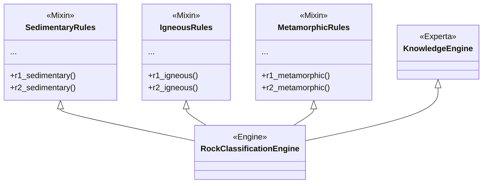

# Sistema experto de clasificacion de rocas

Sistema experto modular basado en conocimiento que utiliza el algoritmo Rete mediante la biblioteca [Experta](https://pypi.org/project/experta/). Este sistema clasifica rocas (sedimentarias, ígneas y metamórficas) a partir de evidencias observables y genera recomendaciones de uso industrial o constructivo.

## Arquitectura Actual

El proyecto está diseñado de forma modular utilizando herencia múltiple (mixins) para mantener el código organizado y escalable.

```text
Rocks_RETE/
|-- main.py              # Punto de entrada principal y ejemplo de uso
|-- requirements.txt     # Dependencias del proyecto
|-- docs/                # Documentación y definición de reglas en texto
|-- src/                 # Código fuente del sistema experto
|   |-- __init__.py
|   |-- engine.py        # Ensambla el motor de inferencia (RockClassificationEngine)
|   |-- facts.py         # Definición de hechos (Evidence, Origin, Classification, Recommendation)
|   |-- utils.py         # Utilidades para inspeccionar la memoria de trabajo y depurar
|   `-- rules/           # Subpaquete de reglas agrupadas por tipo de roca
|       |-- __init__.py
|       |-- igneous.py       # Mixin con reglas para rocas ígneas
|       |-- metamorphic.py   # Mixin con reglas para rocas metamórficas
|       `-- sedimentary.py   # Mixin con reglas para rocas sedimentarias
`-- tests/               # Pruebas unitarias
    `-- test_rules.py    # Casos de prueba automatizados
```

### Diagrama de Arquitectura

El motor principal ensambla las reglas de los diferentes módulos, permitiendo a Experta construir una única red Rete eficiente:



## Estrategias del código para evitar errores

El código implementa varias estrategias fundamentales para garantizar un funcionamiento robusto y lógico durante la inferencia:

1. **Inferencia en 3 Niveles Estrictos**:
   - **Nivel 1 (Origen)**: Las reglas iniciales deducen el origen general (ígneo, metamórfico o sedimentario).
   - **Nivel 2 (Clasificación)**: Las reglas de clasificación requieren estrictamente que el hecho `Origin` exista. Así se evita clasificar erróneamente algo como "Granito" si las evidencias indicaran origen sedimentario.
   - **Nivel 3 (Recomendación)**: Dependen de la existencia previa del hecho `Classification`.

2. **Control de Prioridades y Ambigüedades (`salience` y `NOT`)**:
   - **Saliencia**: Reglas con evidencias muy contundentes tienen `salience` alto (por defecto 5, 4 o 3). Evidencias ambiguas tienen saliencia menor.
   - **Guardas Negativas**: Se usan patrones como `NOT(Origin())` o `NOT(Classification())` en las reglas ambiguas o de menor nivel. Esto asegura que la regla solo se dispare si el sistema *no ha podido* llegar a una conclusión más fuerte por otros medios, evitando choques y sobrescrituras de resultados.

3. **Modularización por Dominio**:
   - Separar las reglas en módulos diferentes (Mixins en `src/rules/`) previene un monolito gigante, reduce la probabilidad de introducir errores tipográficos entre tipos de roca y simplifica la detección y corrección de comportamientos inesperados en las reglas.

## Pruebas que se deben realizar

Para asegurar que el sistema se comporta adecuadamente, la batería de pruebas en `tests/test_rules.py` (o pruebas manuales con el método paso a paso) debe contemplar:

1. **Casos directos (Happy Path)**:
   - Proveer un conjunto de evidencias claras y probar que el sistema infiere el origen, la roca y la recomendación correcta para cada tipo base (sedimentaria, ígnea, metamórfica). Ej: `texture='clastic' + clast_size='sand'` -> `sandstone`.

2. **Casos de Evidencias Ambigüas**:
   - Ingresar hechos como la reacción al ácido (`acid_reaction='strong'`), que puede darse tanto en rocas sedimentarias (caliza) como metamórficas (mármol), y proveer una evidencia diferenciadora (como la foliación o el protolito) para comprobar que la guarda negativa o la inferencia de Nivel 1 encaminan correctamente al Nivel 2 correspondiente.

3. **Ejecución de Diagnóstico (Depuración)**:
   - Si una regla no se dispara o el motor se detiene antes de clasificar, se debe reemplazar en `main.py` la llamada `engine.run()` por la función `run_step_by_step(engine)` provista en `src/utils.py`. Esto pausará el sistema en cada ciclo y mostrará el estado de la **Memoria de Trabajo** y la **Agenda**, revelando exactamente qué reglas se activan y con qué hechos.

## Python y compatibilidad

Experta 1.9.4 es una versión antigua. Sus metadatos en PyPI declaran clasificadores hasta Python 3.8; por tanto, **este proyecto debe ejecutarse con Python 3.8**. `requirements.txt` incluye `frozendict<2.0`; Experta 1.9.4 fija internamente `frozendict==1.2`, así que la resolución normal terminará usando esa versión.

Python 3.9 a 3.11 puede funcionar en algunos entornos, pero no está cubierto por los clasificadores publicados de Experta. La dependencia antigua `frozendict==1.2` puede dar problemas en Python 3.10 y posteriores por cambios en `collections` de la biblioteca estándar. Python 3.12+ tampoco debe considerarse compatible de forma directa. Si el proyecto debe usar esas versiones:

1. Preferir Python 3.8 para ejecutar Experta 1.9.4 sin modificar dependencias.
2. Como alternativa, mantener un fork de Experta que permita una versión moderna de `frozendict` y verificar sus cambios con las pruebas del proyecto.
3. Un parche local de compatibilidad para `collections` antes de importar Experta puede servir como medida temporal, pero no es una solución garantizada y debe probarse con el entorno objetivo.

No se debe asumir que cambiar solo la restricción de `frozendict` en `requirements.txt` actualiza la dependencia: Experta 1.9.4 solicita la versión 1.2 de forma exacta.

## Instalación

Instala Python 3.8 y, desde la carpeta raíz del repositorio, instala Experta. **No es necesario crear ni activar un entorno virtual** para ejecutar este proyecto.

En Windows PowerShell, usa el launcher para asegurar que el paquete se instale en Python 3.8:

```powershell
py -3.8 -m pip install experta
```

También puedes usar el comando corto si `pip` corresponde a Python 3.8:

```powershell
pip install experta
```

Para instalar las dependencias declaradas en el archivo del proyecto:

```powershell
py -3.8 -m pip install -r requirements.txt
```

En macOS o Linux, el equivalente es `python3.8 -m pip install experta`. Un entorno virtual sigue siendo opcional si deseas aislar las dependencias. En VS Code, selecciona el intérprete global de Python 3.8 mediante **Python: Select Interpreter**.

## Ejecución

Desde la raíz del repositorio, ejecuta el programa con Python 3.8:

```powershell
py -3.8 main.py
```

El motor se inicia con un ejemplo en el `main.py`, declara evidencias para clasificar una roca (ej. arenisca) y ejecuta las reglas.

## Pruebas

`unittest` forma parte de Python, por lo que no requiere instalar pytest. Ejecuta las pruebas unitarias automatizadas con Python 3.8:

```powershell
py -3.8 -m unittest discover -s tests -v
```
