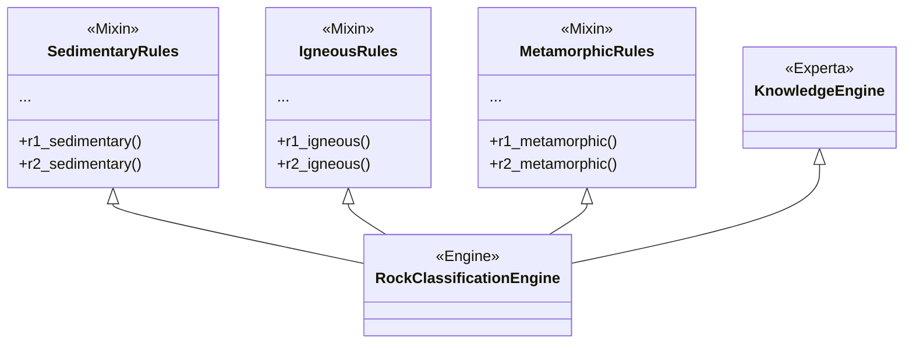

# Rock Classification Expert System

A modular knowledge-based expert system that uses the Rete algorithm via the [Experta](https://pypi.org/project/experta/) library. This system classifies rocks (sedimentary, igneous, and metamorphic) based on observable evidence and generates industrial or construction usage recommendations.

## Current Architecture

The project is designed in a modular way using multiple inheritance (mixins) to keep the code organized and scalable.

```text
Rocks_RETE/
|-- main.py              # Main entry point and usage example
|-- requirements.txt     # Project dependencies
|-- docs/                # Documentation and text-based rule definitions
|-- src/                 # Expert system source code
|   |-- __init__.py
|   |-- engine.py        # Assembles the inference engine (RockClassificationEngine)
|   |-- facts.py         # Facts definitions (Evidence, Origin, Classification, Recommendation)
|   |-- utils.py         # Utilities to inspect the working memory and debug
|   `-- rules/           # Subpackage for rules grouped by rock type
|       |-- __init__.py
|       |-- igneous.py       # Mixin with rules for igneous rocks
|       |-- metamorphic.py   # Mixin with rules for metamorphic rocks
|       `-- sedimentary.py   # Mixin with rules for sedimentary rocks
`-- tests/               # Unit tests
    `-- test_rules.py    # Automated test cases
```

### Architecture Diagram

The main engine assembles the rules from the different modules, allowing Experta to build a single, efficient Rete network:



## Strategies Implemented to Avoid Errors

The code implements several key strategies to ensure robust and logical operation during inference:

1. **Strict 3-Level Inference**:
   - **Level 1 (Origin)**: Initial rules deduce the general origin (igneous, metamorphic, or sedimentary).
   - **Level 2 (Classification)**: Classification rules strictly require the `Origin` fact to exist. This prevents mistakenly classifying something as "Granite" if the evidence indicates a sedimentary origin.
   - **Level 3 (Recommendation)**: These depend on the prior existence of the `Classification` fact.

2. **Priority Control and Ambiguities (`salience` and `NOT`)**:
   - **Salience**: Rules with very strong evidence have high `salience` (defaulting to 5, 4, or 3). Ambiguous evidence has lower salience.
   - **Negative Guards**: Patterns like `NOT(Origin())` or `NOT(Classification())` are used in ambiguous or lower-level rules. This ensures that the rule only fires if the system *has not been able* to reach a stronger conclusion through other means, avoiding clashes and overwritten results.

3. **Domain Modularization**:
   - Separating the rules into different modules (Mixins in `src/rules/`) prevents a giant monolith, reduces the probability of introducing typos between rock types, and simplifies detecting and correcting unexpected behavior in the rules.

## Tests to be Performed

To ensure the system behaves properly, the test suite in `tests/test_rules.py` (or manual tests using the step-by-step method) should cover:

1. **Direct Cases (Happy Path)**:
   - Provide a set of clear evidence and test that the system infers the correct origin, rock, and recommendation for each base type (sedimentary, igneous, metamorphic). E.g., `texture='clastic' + clast_size='sand'` -> `sandstone`.

2. **Ambiguous Evidence Cases**:
   - Input facts such as acid reaction (`acid_reaction='strong'`), which can occur in both sedimentary (limestone) and metamorphic (marble) rocks, and provide a differentiating piece of evidence (like foliation or protolith) to verify that the negative guard or Level 1 inference correctly routes to the corresponding Level 2.

3. **Diagnostic Execution (Debugging)**:
   - If a rule does not fire or the engine stops before classifying, the `engine.run()` call in `main.py` should be replaced by the `run_step_by_step(engine)` function provided in `src/utils.py`. This will pause the system at each cycle and display the state of the **Working Memory** and the **Agenda**, revealing exactly which rules are triggered and with what facts.

## Python and Compatibility

Experta 1.9.4 is an older version. Its PyPI metadata declares classifiers up to Python 3.8; therefore, **this project must be run with Python 3.8**. `requirements.txt` includes `frozendict<2.0`; Experta 1.9.4 internally pins `frozendict==1.2`, so normal resolution will end up using that version.

Python 3.9 through 3.11 may work in some environments, but they are not covered by Experta's published classifiers. The older `frozendict==1.2` dependency may cause issues in Python 3.10 and later due to changes in the standard library's `collections`. Python 3.12+ should also not be considered directly compatible. If the project must use these versions:

1. Prefer Python 3.8 to run Experta 1.9.4 without modifying dependencies.
2. Alternatively, maintain a fork of Experta that allows a modern version of `frozendict` and verify its changes against the project's tests.
3. A local compatibility patch for `collections` before importing Experta can serve as a temporary workaround, but it is not a guaranteed solution and must be tested in the target environment.

It should not be assumed that changing only the `frozendict` restriction in `requirements.txt` updates the dependency: Experta 1.9.4 requests version 1.2 exactly.

## Installation

Install Python 3.8 and, from the repository root, install Experta. **There is no need to create or activate a virtual environment** to run this project.

In Windows PowerShell, use the launcher to ensure the package installs in Python 3.8:

```powershell
py -3.8 -m pip install experta
```

You can also use the short command if `pip` corresponds to Python 3.8:

```powershell
pip install experta
```

To install dependencies declared in the project file:

```powershell
py -3.8 -m pip install -r requirements.txt
```

On macOS or Linux, the equivalent is `python3.8 -m pip install experta`. A virtual environment is still optional if you wish to isolate dependencies. In VS Code, select the global Python 3.8 interpreter via **Python: Select Interpreter**.

## Execution

From the repository root, run the program with Python 3.8:

```powershell
py -3.8 main.py
```

The engine starts with an example in `main.py`, declares evidence to classify a rock (e.g., sandstone), and runs the rules.

## Tests

`unittest` is part of Python, so it does not require installing pytest. Run the automated unit tests with Python 3.8:

```powershell
py -3.8 -m unittest discover -s tests -v
```
